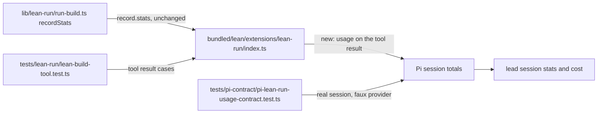

# Count a lean run's usage in the lead's session totals

## Approach
`lean_build` and `lean_review` run whole agent sessions (builder, reviewer, envelope repair turns) inside one tool call, but their tool result carries no `usage`, so the lead's Pi session totals leave out every run it started. Pi adds a tool result's `usage` to the session's totals (input, output, cache read, cache write, and `cost.total`), and its extension docs say a tool that makes nested model calls should report them this way. The runner already records each session's figures in `record.stats` (the content of `stats.json`). So: in the lean-run extension, sum every `record.stats` entry that has session stats into one Pi `Usage` and return it on the tool result of both tools. A run with no session stats at all returns no `usage` field. Nothing else in the result changes: `content` and `details` stay as they are, no `outputSchema` is added, and the runner, the run record, `tokensUsed` (the budget's input plus output count) and the summary are not touched.

## Touches
- `bundled/lean/extensions/lean-run/index.ts`: `toolResult` also receives the run record and adds `usage` when at least one `record.stats` entry has `spawn`; both `lean_build` and `lean_review` pass their record. The sum is a small local function: tokens field by field, `totalTokens` as the sum of the four counts, the stages' `cost` numbers added into `cost.total` with the other cost fields `0`.
- `tests/lean-run/lean-build-tool.test.ts`: tool-level cases for B-2, B-3 and B-5, and the `lean_review` half of B-4, using records whose `stats` hold builder, reviewer and repair entries.
- `tests/pi-contract/pi-lean-run-usage-contract.test.ts`: new contract test for B-1 and B-4 on the real `createAgentSession` with the faux provider (no network): the same prompts run once with a stub record that has stage stats and once with one that has none, and the difference in `session.getSessionStats()` equals the stage totals.
- `bundled/lean/README.md`: one sentence in "Token budget" saying a run's usage is returned on the tool result and so counts in the lead's session totals, and that this is the per-stage figure with cache reads and writes, not `tokensUsed`.

## Reuses
- `lib/lean-run/types.ts`: `RunRecord.stats` (`StageStats[]`, each with an optional `spawn: SessionStats` and a `repair` flag). These are the figures to sum; no new bookkeeping in `lib/lean-run/run-build.ts`.
- `lib/orchestration/types.ts`: `SpawnStats` and `TokenStats` (`input`, `output`, `cacheRead`, `cacheWrite`, `total`, and one `cost` number), the shape of each stage's figures.
- `node_modules/@earendil-works/pi-ai/dist/types.d.ts`: the `Usage` type the tool result must match, imported as a type from `@earendil-works/pi-ai`.
- `tests/pi-contract/pi-lean-user-messages-contract.test.ts`: the session setup to copy for the new contract test (faux provider registered on a `ModelRuntime` with a temp agent dir, `DefaultResourceLoader` with `createLeanRunExtension` given a stub `runBuild` and `createBackends`, `tools: ["lean_build"]`, in-memory session, `fauxToolCall`).
- `tests/helpers/fs.ts`: `useTempDir` for the contract test's agent directory.
- `tests/helpers/mocks/extension-api.ts`: `createMockPi` and its `callTool`, which the tool-level tests already use through `setup()`, `record()` and `reviewRecord()`.

## Behaviors
- B-1: the lead's session totals from `session.getSessionStats()` / the lead calls `lean_build` and the run's builder and reviewer stages report token stats / input, output, cache-read and cache-write tokens and cost are each higher by exactly the sum over the run's stages than for the same conversation with a run that reported none
- B-2: a caller reading the `lean_build` tool result / a run whose `stats` include an envelope repair turn with session stats and a stage entry without any / `usage` counts every entry that has session stats once, the repair turn included, and skips the entry without
- B-3: a caller reading the `lean_build` tool result / a run in which no stage reported session stats / the result has no `usage` field
- B-4: the lead's session totals from `session.getSessionStats()` / the lead calls `lean_review` and the reviewer stage reports token stats / the totals are higher by the reviewer stage's figures
- B-5: a caller reading either tool's result / any `lean_build` or `lean_review` call, with or without stage stats / `content` and `details` are exactly what they were before the change

## Risks
- Pi's `Usage.cost` has a field per token kind and a run record has one cost number per stage. Only `cost.total` is filled. Pi's totals read only `cost.total` (`addUsageToTotals`), on 1.0.1 and unchanged on 1.0.3, so the session cost is right; a future reader of the per-kind fields would see zeros.
- `codex-cli` reports tokens and no cost, so its runs add tokens and `0` cost. A stage whose usage is incomplete adds a lower bound. `run.json` already warns in both cases; this change adds no new wording.
- A run that throws returns no record, so what it spent before the throw is still not counted. Same as today, out of scope.
- Double counting. The only readers of a session's totals are `captureSpawnStats` in `lib/orchestration/agent-spawner.ts` and the spawn tool's completion stats; neither adds a run record to them, and builder and reviewer sessions do not load this extension, so nothing recurses. A lead that is itself spawned now reports its runs in its own stats, which is the intent. Do not add any aggregate that sums a lead's stats with a run's `stats.json`.
- The lean token budget must not move: it is enforced from `tokensUsed` in the run record, never from the tool result. Leave `recordStats` alone.
- In Pi's per-model cost breakdown a run's usage appears under "Tools/summaries", not under the builder's or reviewer's model. Accepted.

## Diagram

